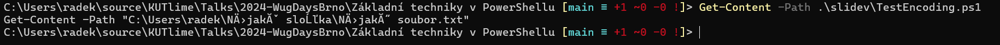

# Základní techniky PowerShellu

které by každý SysAdmin měl znát

<div class="flex flex-col items-center">
  <div>
    
  </div>

</div>

---
hideInToc: true
---

# Obsah přednášky

<Toc minDepth="1" maxDepth="2"></Toc>
--- 

# Proč tato přednáška vznikla?

<div v-click>- Témata, se kterými na základním školení PS vždy bojujeme</div>
<div v-click>- Snaha vysvětlit téma na záznam, aby veřejně dostupné ke studiu</div>
<div v-click>- Ochrana psychického zdraví autora přednášky 🤷🏿‍♀️</div>

---
layout: two-cols
---

::right::

<div class="flex flex-col items-center">
  <div>
    
    
  </div>

</div>

::default::

# Kolekce obecně

- Abstraktní pojem zahrnující různé organizace paměti
- Lze si představit jako
  * bonboniéru
  * kartotéku u lékaře,
  * Česko-Anglický slovník
  * zásobník u kulometu (LIFO)
  * frontu na oběd (FIFO)
  * hromadu špinavého nádobí (LIFO)
  * atd.

---

# Pole

- Základní kolekce v PowerShellu
- Označuje kolekci se sekvenčním uložením paměti, ideálně položek stejného datového typu
- Drtivá většina cmdletů vrací pole jako výstup 🫣
- Reálně je to datový typ `System.Object[]`
- Položky jsou dynamicky typované

---
hideInToc: true
---

# Co je dobré opravdu vědět o poli?

- Typově nebezpečný
- ❗číslováno od nuly
- Výchozí hodnota je `$null`
- Jak nejlépe otestoval pole, že je `$null`?
```powershell {minHeigh:'80px' maxHeight:'100px'}
$foo.Count -gt 0
```

---
hideInToc: true
---

# Jak pole vytvořit?

````md magic-move

```powershell
$array = @(1, 2, 3)
```

```powershell
$array = 1, 2, 3
```

````

---
hideInToc: true
---

# Jak vytvořit prázdné pole?

````md magic-move

```powershell
$array = @(1, 2, 3)
```

```powershell
$array = 1, 2, 3
```

```powershell
$array = 1, 2
```

```powershell
$array = 1
```

```powershell
$array = ❓ # ehm to asi neklapne 🤔
```

```powershell
$array = @(1, 2, 3)
```

```powershell
$array = @(1, 2)
```

```powershell
$array = @(1)
```

```powershell
$array = @()
```

````
---
hideInToc: true
---

# Jak vytvořit typově bezpečné pole?

````md magic-move

```powershell {all|2|3}
# Typově nebezpečné pole
$array = 1, 2, 3
$array[0] = 'Hello world!' # porušení datového typu
```

```powershell
$array = 1, 2, 3
```

```powershell
$array = 1
```

```powershell
[int]$array = 1
```

```powershell
[int[]]$array = 1
```

```powershell 
[int[]]$array = 1, 2, 3
```

````
---

# ArrayList a Seznam (List)

- Transformace pole jsou pomalé
- Co když chceme/potřebujeme výkon? 🤔
- Co když chce uživatelskou přívětivost? 🤔
- Pojďme se podívat do kódu na další kouzla...

---

# HashTable

- Kolekce typu slovník
- Pro každý _klíč_, nese **hodnotu**.
- Efektivní především pro vyhledávání.
- Používá se např. při definici filtrů pro objekty v AD.

## Syntaxe hashtable

````md magic-move

```powershell
@hashTable = @{} # prázdná tabulka
```

```powershell
@hashTable = @{

}
```

```powershell
@hashTable = @{
  SomeKey
}
```

```powershell
@hashTable = @{
  SomeKey =
}
```

```powershell
@hashTable = @{
  SomeKey = 'someValue'
}
```

```powershell
@hashTable = @{
  SomeKey = 'someValue'
  SomeOtherKey = 'SomeOtherValue'
}
```

```powershell
$someVariable = 5

@hashTable = @{
  SomeKey = 'someValue'
  SomeOtherKey = 'SomeOtherValue'
  SomeAdditionalKey = $someVariable
}
```

```powershell
$someVariable = 5

@hashTable = @{
  SomeKey = 'someValue'
  SomeOtherKey = 'SomeOtherValue'
  SomeAdditionalKey = $someVariable
  SomeBoolKey = $true
}
```

```powershell
$someVariable = 5

@hashTable = @{
  SomeKey = 'someValue'
  SomeOtherKey = 'SomeOtherValue'
  SomeAdditionalKey = $someVariable
  SomeBoolKey = $true
  SomeNestedHashTable = @{
    Key1 = 'Something'
  }
}
```

````

--- 

# PSCustomObject

- Typový excelerátor pro .NET třídu PSObject
- Klíče zachovávají pořadí definice
- Netvoří zanořenou strukturu klíčů, ale vlastnosti s hodnotami.
- Vhodnější pro strukturovaná data

````md magic-move
```powershell
@{
  FirstName = 'Radek'
  LastName = 'Zahradník'
}

Name                           Value
----                           -----
LastName                       Zahradník
FirstName                      Radek
```

```powershell
[PSCustomObject]@{
  FirstName = 'Radek'
  LastName = 'Zahradník'
}

FirstName LastName
--------- --------
Radek     Zahradník
```
````

---

# Splatting

- K čemu je tedy dobrá hashtable?

...co třeba když má cmdlet moc parametrů.

````md magic-move

```powershell {all|2}
$sliteNames = 'psbasics'
Start-Process -FilePath 'docker' -ArgumentList "run --name $slideNames --rm -it -p 3030:3030 $slideNames" -NoNewWindow -Wait
```

```powershell
Start-Process -FilePath 'docker' -ArgumentList "run --name $slideNames --rm -it -p 3030:3030 $slideNames" `
-NoNewWindow -Wait
```

```powershell
Start-Process -FilePath 'docker' -ArgumentList "run --name $slideNames --rm -it -p 3030:3030 $slideNames" `# Tohle by byl průšvih
-NoNewWindow -Wait
```

```powershell
Start-Process -FilePath 'docker' -ArgumentList "run --name $slideNames --rm -it -p 3030:3030 $slideNames"` # Tohle taky
-NoNewWindow -Wait
```

```powershell
Start-Process -FilePath 'docker' -ArgumentList "run --name $slideNames --rm -it -p 3030:3030 $slideNames" -NoNewWindow -Wait
```

```powershell
$arguments = @{}
Start-Process -FilePath 'docker' -ArgumentList "run --name $slideNames --rm -it -p 3030:3030 $slideNames" -NoNewWindow -Wait
```

```powershell
$arguments = @{
  FilePath = 'docker'
}
Start-Process -ArgumentList "run --name $slideNames --rm -it -p 3030:3030 $slideNames" -NoNewWindow -Wait
```

```powershell
$arguments = @{
  FilePath = 'docker'
  ArgumentList = "run --name $slideNames --rm -it -p 3030:3030 $slideNames"
}
Start-Process -NoNewWindow -Wait
```

```powershell
$arguments = @{
  FilePath = 'docker'
  ArgumentList = "run --name $slideNames --rm -it -p 3030:3030 $slideNames"
  NoNewWindow = $true
}
Start-Process -Wait
```

```powershell
$arguments = @{
  FilePath = 'docker'
  ArgumentList = "run --name $slideNames --rm -it -p 3030:3030 $slideNames"
  NoNewWindow = $true
  Wait = $true
}
Start-Process ❓
```

```powershell
$arguments = @{
  FilePath = 'docker'
  ArgumentList = "run --name $slideNames --rm -it -p 3030:3030 $slideNames"
  NoNewWindow = $true
  Wait = $true
}
Start-Process @arguments
```

````

<v-click>

Tady je prosím pěkně <span v-mark.circle.orange="4">zavináč <code>@</code>❗</span>

</v-click>
---

# "Eskejpování" uvnitř stringu

- Opět častý problém pochopit, kdy a jak použít **operátor podvýrazu** `$()`
- Někdy (_tj. často_) potřebujeme uvnitř stringu vyhodnotit _nějaký_ výraz

````md magic-move

```powershell
"Get-Date" # Tohle neklapne
```

```powershell
$date = Get-Date
"$date" # Tohle klapne, ale...
```

```powershell
$services = Get-Service
"Počet běžících služeb: $services.Length"
```

```powershell
$services = Get-Service
$count = $services.Length
"Počet běžících služeb: $count"
```

```powershell
$services = Get-Service
"Počet běžících služeb: $services.Length"
```

```powershell
$services = Get-Service
"Počet běžících služeb: $($services.Length)"
```

```powershell
"Počet běžících služeb: $(Get-Service.Length)" # Tohle taky neklapne
```

```powershell
"Počet běžících služeb: $((Get-Service).Length)" # Tohle taky neklapne
```

````

--- 

# Skripty v UTF-8

- PowerShell v7.x.x se chová jinak než Windows PowerShell
- Windows PowerShell očekává BOM, pokud by měl soubor obsahovat non-ASCII znaky
- V praxi hlavně u cest a jmen lidí.

```powershell
# Script, ve kterém třeba najdeme...
Get-Content -Path "C:\Users\radek\Nějaká složka\Nějaký soubor.txt"'
```

<div class="flex flex-col items-center">
  <div>
    
  </div>

</div>
---
